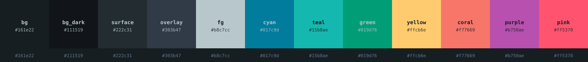

<div align="center">

# Box UK Contrast

**A calm deep blue-grey + teal color palette** — Material-Ocean family, low glare, high legibility.
Ported from the [vonqo](https://github.com/vonqo/vonqo) IntelliJ *Box UK Contrast (rainglow)* theme
into a tool-agnostic palette + ready-to-use themes.



</div>

---

## Palette

### Grounds

| Name | Hex | Role |
|------|-----|------|
| `bg` | `#161e22` | primary background — editor / terminal ground |
| `bg_dark` | `#111519` | darker ground — console, panels |
| `bg_highlight` | `#1b2228` | line highlight, indent guide, floats |
| `surface` | `#222c31` | raised panels, selection surfaces |
| `overlay` | `#303b47` | line numbers, borders, bright-black |

### Text

| Name | Hex | Role |
|------|-----|------|
| `fg` | `#b8c7cc` | body text |
| `fg_dim` | `#60778c` | comments, muted |
| `fg_soft` | `#e6e6e6` | operators, punctuation |

### Accents

| Name | Hex | Role |
|------|-----|------|
| `cyan` | `#017c9d` | keywords, tags, active states, focus |
| `teal` | `#15b8ae` | strings, numbers, constants, cursor, links |
| `green` | `#019d76` | functions, classes, attributes |
| `yellow` | `#ffcb6e` | modified, warnings |
| `coral` | `#f77669` | errors, deleted |
| `pink` | `#ff5370` | secondary error / accent |
| `purple` | `#b750ae` | special, dates, numbers accent |

### 16-color ANSI

| # | Normal | | # | Bright |
|---|--------|-|---|--------|
| 0 black | `#161e22` | | 8 | `#303b47` |
| 1 red | `#f77669` | | 9 | `#ff5370` |
| 2 green | `#019d76` | | 10 | `#15b8ae` |
| 3 yellow | `#ffcb6e` | | 11 | `#ffd68a` |
| 4 blue | `#017c9d` | | 12 | `#2f9dc0` |
| 5 magenta | `#b750ae` | | 13 | `#ff5370` |
| 6 cyan | `#15b8ae` | | 14 | `#4fd8ce` |
| 7 white | `#b8c7cc` | | 15 | `#e6e6e6` |

---

## Ready-to-use themes

Drop-in configs live in [`themes/`](themes/):

| Tool | File |
|------|------|
| kitty | [`themes/kitty.conf`](themes/kitty.conf) |
| Ghostty | [`themes/ghostty`](themes/ghostty) |
| WezTerm | [`themes/wezterm.lua`](themes/wezterm.lua) |
| Alacritty | [`themes/alacritty.toml`](themes/alacritty.toml) |
| CSS variables | [`themes/boxuk.css`](themes/boxuk.css) |
| IntelliJ (source) | [`themes/intellij_boxUKContrast.jar`](themes/intellij_boxUKContrast.jar) |

Machine-readable single source of truth: [`palette.json`](palette.json).

---

## Wallpaper

A matching desktop wallpaper (deep blue-grey ground, corner teal glow, subtle
grid + brand ring) lives in [`wallpapers/`](wallpapers/):


- [`boxuk-contrast-3840x2160.png`](wallpapers/boxuk-contrast-3840x2160.png) — 2×, for Retina / 4K
- [`boxuk-contrast-1920x1080.png`](wallpapers/boxuk-contrast-1920x1080.png) — 1×, 1080p

**macOS** — set it from the terminal:
```sh
osascript -e 'tell application "System Events" to set picture of every desktop to "'"$PWD"'/wallpapers/boxuk-contrast-3840x2160.png"'
```

---

## Usage

**kitty** — `cp themes/kitty.conf ~/.config/kitty/boxuk.conf`, then in `kitty.conf`:
```conf
include boxuk.conf
```

**Ghostty** — append `themes/ghostty` to `~/.config/ghostty/config`.

**Alacritty** — `cp themes/alacritty.toml ~/.config/alacritty/boxuk.toml`, then:
```toml
import = ["~/.config/alacritty/boxuk.toml"]
```

**Web / CSS** — import `themes/boxuk.css` and use `var(--boxuk-cyan)` etc.

**Anything else** — read the hex values straight from `palette.json`:
```bash
jq -r '.accents.cyan' palette.json   # #017c9d
```

---

## Credit

Colors extracted from the **Box UK Contrast (rainglow)** IntelliJ IDEA theme by
[vonqo](https://github.com/vonqo/vonqo). This repo repackages that palette as a
portable, tool-agnostic color set. Part of the
[kyuna0312/dotfiles](https://github.com/kyuna0312/dotfiles) stack.

## License

MIT
