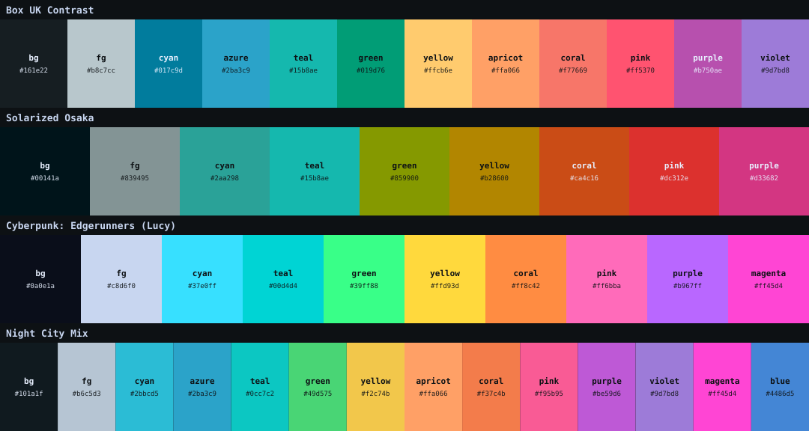
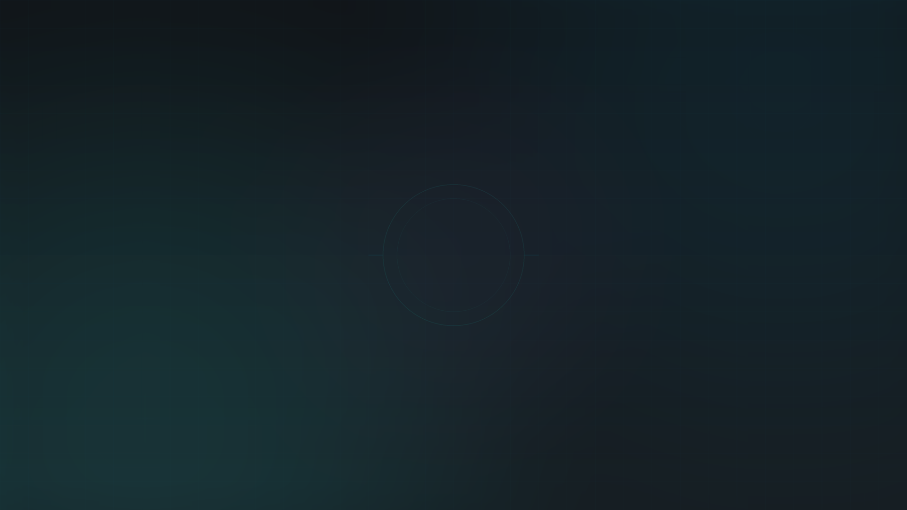
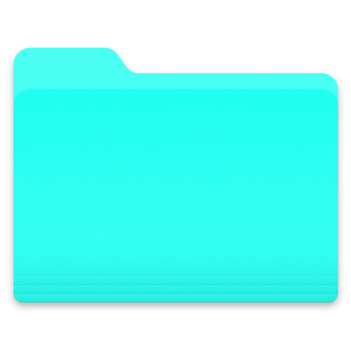

<div align="center">

# Night City Palettes

**Four dark palettes for terminals, editors and UI — calm to neon.**
Each ships as a JSON source-of-truth plus drop-in terminal themes, and the set
comes with a matching wallpaper and a macOS folder icon.



</div>

---

## The palettes

Each palette has a JSON single-source-of-truth in [`palettes/`](palettes/)
(grounds, foreground, accents, and a full 16-color ANSI set), and drop-in
terminal themes under [`themes/<palette>/`](themes/).

| Palette | Vibe | bg | accent | Files |
|---------|------|----|--------|-------|
| **Box UK Contrast** | calm deep blue-grey + teal (Material Ocean) | `#161e22` | `#017c9d` | [json](palettes/box-uk-contrast.json) · [themes](themes/box-uk-contrast/) |
| **Solarized Osaka** | muted teal/olive — port of [craftzdog's](https://github.com/craftzdog/solarized-osaka.nvim) | `#00141a` | `#2aa298` | [json](palettes/solarized-osaka.json) · [themes](themes/solarized-osaka/) |
| **Cyberpunk: Lucy** | icy blue-white + neon cyan/magenta (Edgerunners) | `#0a0e1a` | `#37e0ff` | [json](palettes/cyberpunk-lucy.json) · [themes](themes/cyberpunk-lucy/) |
| **Night City Mix** | the blend of all three — calm grounds, neon pop | `#101a1f` | `#2bbcd5` | [json](palettes/night-city-mix.json) · [themes](themes/night-city-mix/) |

**Night City Mix** is generated from the other three by
[`scripts/blend.py`](scripts/blend.py): a gamma-correct weighted blend where
Box UK wins the grounds (60%), Lucy wins the accents (50%) and brights (70%),
and Solarized Osaka contributes structure throughout — the pop of neon
without the glare. Rerun the script after touching any source palette.

---

## Use a palette

**Terminal themes** — each palette has ready-to-paste `kitty.conf`, `ghostty`,
`alacritty.toml`, and `wezterm.lua` files:

```sh
# kitty — pick any palette
cp themes/cyberpunk-lucy/kitty.conf ~/.config/kitty/theme.conf
# then in kitty.conf:  include theme.conf
```

```sh
# Ghostty — append the palette's file to your config
cat themes/night-city-mix/ghostty >> ~/.config/ghostty/config
```

```toml
# Alacritty — import the palette's toml
import = ["~/.config/alacritty/box-uk-contrast/alacritty.toml"]
```

Box UK Contrast also ships
[CSS variables](themes/box-uk-contrast/boxuk.css) and the original
[IntelliJ theme](themes/box-uk-contrast/intellij_boxUKContrast.jar).

**Anything else** — read the hexes straight from the JSON. The `ansi` block maps
1:1 onto any terminal's 16 colors:

```sh
jq -r '.ansi' palettes/cyberpunk-lucy.json
jq -r '.accents.cyan' palettes/night-city-mix.json   # #22abbd
```

---

## Box UK Contrast — role reference

The flagship palette, mapped to editor/terminal roles (as used by
[NyanVim](https://github.com/kyuna0312/NyanVim)). Anchors carry the identity;
azure, apricot and violet are supporting tones that keep every syntax role
visually distinct:

| Name | Hex | Role |
|------|-----|------|
| **Blue-Grey** | `#161e22` | the ground everywhere — terminal, editor, bar |
| **Surface** | `#1b2228` / `#222c31` | panels, floats, inactive tabs |
| **Cyan** | `#017c9d` | active states, focus, borders |
| **Azure** | `#2ba3c9` | functions, properties |
| **Teal** | `#15b8ae` | strings, cursor, links, clock |
| **Green** | `#019d76` | keywords, added |
| **Apricot** | `#ffa066` | numbers, booleans, constants |
| **Yellow** | `#ffcb6e` | types, warnings, modified |
| **Coral** | `#f77669` | errors, deleted |
| **Purple** | `#b750ae` | special, dates |
| **Violet** | `#9d7bd8` | todo, hints |
| **Grey-Blue FG** | `#b8c7cc` | body text |

---

## Wallpaper

A matching desktop wallpaper (deep blue-grey ground, corner teal glow, subtle
grid + brand ring) in [`wallpapers/`](wallpapers/):



- [`boxuk-contrast-3840x2160.png`](wallpapers/boxuk-contrast-3840x2160.png) — 2×, Retina / 4K
- [`boxuk-contrast-1920x1080.png`](wallpapers/boxuk-contrast-1920x1080.png) — 1×, 1080p

**macOS** — set it from the terminal:
```sh
osascript -e 'tell application "System Events" to set picture of every desktop to "'"$PWD"'/wallpapers/boxuk-contrast-3840x2160.png"'
```

---

## Folder icon

A teal recolor of the macOS folder icon, in [`extras/`](extras/):



```sh
extras/set-folder-icon.sh ~/Desktop/my-folder ~/projects/another
```

Sets the custom icon via `NSWorkspace` (built into macOS — no extra tools).

---

## Credit

- **Box UK Contrast** — colors extracted from the *Box UK Contrast (rainglow)* IntelliJ theme by [vonqo](https://github.com/vonqo/vonqo).
- **Solarized Osaka** — [craftzdog/solarized-osaka.nvim](https://github.com/craftzdog/solarized-osaka.nvim).
- **Cyberpunk: Lucy** — drawn from the *Cyberpunk: Edgerunners* Lucy color identity.

## Related

- **[NyanVim](https://github.com/kyuna0312/NyanVim)** — a hand-rolled Neovim config running Box UK Contrast as its colorscheme.
- **[dotfiles](https://github.com/kyuna0312/dotfiles)** — the full macOS dev environment themed with these palettes.
- **[aeroline](https://github.com/kyuna0312/aeroline)** — a vertical Übersicht + AeroSpace status bar, themeable with any of these palettes.

## License

MIT
